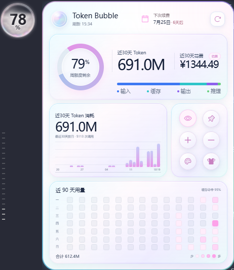
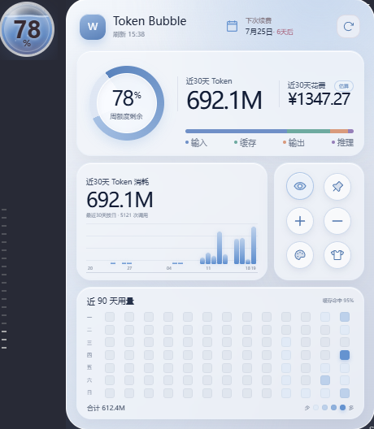
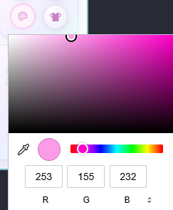
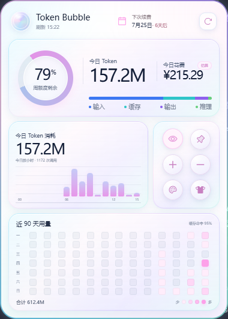
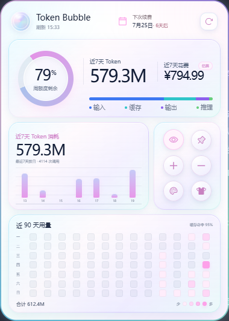
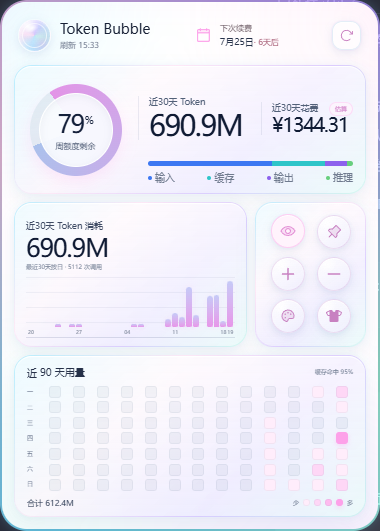

# Token Bubble 余量浮窗

**简体中文** · [English](README.en.md)

Token Bubble 是一个本地优先的 Codex 额度与 Token 用量桌面浮窗。它将额度、Token 分布、估算花费和近期用量放在一个可调整、可固定的轻量面板中。

Token Bubble 基于 **Quota Float** 开发，并集成 **CodexScope** 的本地用量验证功能。原项目版权及许可证归各自作者所有，详见 [THIRD_PARTY_NOTICES.md](THIRD_PARTY_NOTICES.md)。

## 下载

- [下载最新版安装包](https://github.com/h17612764275-cloud/token-bubble/releases/latest)
- 当前版本：`v0.1.5`
- Windows 用户下载 Release 中的 `.exe` 安装包。

## 界面预览

### 两款面板皮肤

Token Bubble 提供肥皂泡皮肤（Bubble）和玻璃瓶皮肤（Glass）。面板与浮窗会同步使用所选皮肤的材质和视觉样式。

| 肥皂泡皮肤（Bubble） | 玻璃瓶皮肤（Glass） |
| --- | --- |
|  |  |

### 两款皮肤均可自由取色

Bubble 和 Glass 两款面板都支持取色换色。打开取色器后，可以使用色板、色相条或 RGB 数值设置喜欢的界面颜色。



### 今日、近7天和近30天

点击用量范围可以在今日、近7天和近30天之间切换。面板会同步更新 Token 总量、柱状图、Token 类型分布和估算花费。

| 今日 | 近7天 | 近30天 |
| --- | --- | --- |
|  |  |  |

### 浮窗样式

浮窗会匹配 Bubble 或 Glass 皮肤，可调整尺寸、固定位置并保持置顶。点击浮窗可以打开完整面板。

| Bubble 浮窗 | Glass 浮窗 |
| --- | --- |
|  |  |

## 主要功能

- 显示 Codex 周期剩余额度、刷新时间和额度状态。
- 切换今日、近7天、近30天的 Token 用量。
- 展示输入、缓存、输出和推理 Token 的分布。
- 根据本地 Token 用量估算花费。
- 使用柱状图和近90天热力图查看使用趋势。
- 切换 Bubble 与 Glass 面板皮肤，并为两款皮肤自由取色。
- 调整浮窗大小、固定浮窗位置并保持窗口置顶。
- 设置会员续费日期并显示距离续费还有多少天。
- 从托盘快速刷新、显示或隐藏面板和浮窗。

## 使用说明

1. 安装并启动 Token Bubble。
2. 确保本机 Codex Desktop 已登录。
3. 点击面板中的用量范围，在今日、近7天和近30天之间切换。
4. 使用右侧控制按钮切换 Bubble/Glass 皮肤、打开取色器、调整尺寸或固定浮窗。
5. 点击顶部续费日期设置会员续费时间。

## 数据与隐私

Token Bubble 在本机读取现有 Codex Desktop 登录状态，以只读方式查询额度。Token 用量历史、界面设置和会员续费日期保存在本地。

- 不上传提示词、聊天内容或本地用量历史。
- 不记录遥测、分析数据或崩溃报告。
- 不兑换重置额度，也不修改账户设置。
- 本地 Token 统计用于历史和验证视图，不会替代服务端返回的真实额度。

完整边界请查看 [PRIVACY.md](PRIVACY.md) 和 [SECURITY.md](SECURITY.md)。

## 来源与授权

Token Bubble 是独立的衍生项目，并非 Quota Float 或 CodexScope 的官方版本。

- **Quota Float**：提供了基础桌面浮窗架构与 Codex 额度展示能力。
- **CodexScope**：提供了本地 Token 用量验证相关组件。
- **Token Bubble**：在上述基础上增加了新的面板、皮肤、时间范围、Token 分布、估算花费、浮窗控制和会员续费设置。

许可证和第三方声明见 [LICENSE](LICENSE) 与 [THIRD_PARTY_NOTICES.md](THIRD_PARTY_NOTICES.md)。

## 本地开发

需要 Node.js 20+、Rust stable 和 Tauri 2 对应的系统依赖。

```bash
npm install
npm run test
npm run build
npm run tauri dev
```

构建安装包：

```bash
npm run tauri build
```

## 反馈

请通过 [GitHub Issues](https://github.com/h17612764275-cloud/token-bubble/issues) 提交问题或建议。发布截图和日志前，请移除令牌、账号信息、邮箱和本地文件路径。
